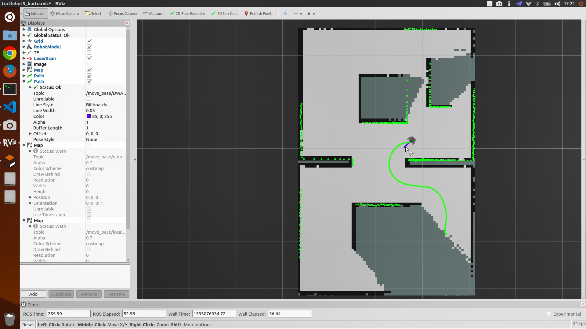
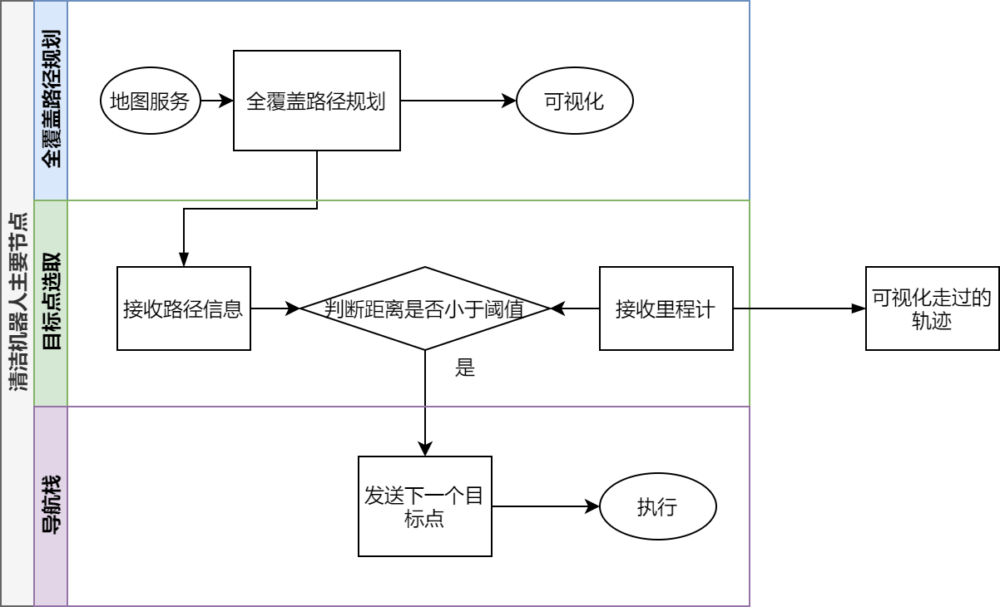

# 自主清洁机器人仿真
## 效果展示视频
[【bilibili】](https://www.bilibili.com/video/BV17z4y1D7Wj)


全覆盖路径规划


自主探索建图


## 安装依赖
```bash
sudo apt install ros-${ROS_DISTRO}-turtlebot3 ros-${ROS_DISTRO}-navigation ros-${ROS_DISTRO}-dwa-local-planner ros-${ROS_DISTRO}-slam-karto
```

## 使用方法
### 自主探索
explore中为自动探索的包，可以搭配任意的slam算法

自主探索建图示例启动方法 

```bash
export TURTLEBOT3_MODEL=burger 
roslaunch clean_robot auto_slam.launch
```
### 自主探索

清扫启动方法 

```bash
export TURTLEBOT3_MODEL=burger 
roslaunch clean_robot clean_work.launch
```
### 手动导航建图

```bash
export TURTLEBOT3_MODEL=burger 
roslaunch clean_robot nav_slam.launch
```

## 系统结构


## 文件结构
`clean_robot`包中

`CleaningPathPlanner.cpp/h`为路径规划核心程序，  
`next_goal.cpp`为发布下一个目标点的源程序，  
`PathPlanningNode.cpp`为对路径规划的封装。  

整个包会形成两个节点`path_planning_node`与`next_goal`分表示全覆盖路径规划器与目标点发送程序。


Launch文件中

`clean_work.launch`表示启动清洁工作，  
`auto_slam.launch `表示全自主探索建图（全自动不需要人干预）  
`nav_slam.launch`表示导航建图（也可以使用键盘控制建图），
`gazebo.launch`表示启动仿真环境，  
`move_base.launch`表示机器人的导航栈配置，  
`amcl.launch`表示粒子滤波定位系统，  
`turtlebot3_navigation.launch`，表示机器人导航系统  
`Config` 为路径规划所使用参数的yaml文件，  
`param`为move_base所采用的参数文件，  
`maps`表示地图文件，worlds为仿真环境。

## 算法思想
### 全覆盖路径规划
将原有的栅格地图无障碍物区域按照机器人大小进行分割，分割后直接对所有分割区域进行遍历即可。（按照一定规则直接进行遍历，不能保证路径最优，可以实现相对较优，完成基本功能）。
1. 如果机器人前方已经被覆盖过了或者是障碍,那么左转或者右转旋转180度接着走，实现S型走，如图5所示。 
2. 如果机器人的周围都被覆盖过了，以当前机器人的位置为起点，未清洁区域作为目标点，用A*算法找出路径。重复1，2
3. 如果没有未清洁区域，算法结束
   


### exploration
考虑到真正的清洁机器人不可能让用户操作建图，因此尝试使用自主探索建图。采用开源的`explore_lite`包实现自主探索建图，其思路为找到可以达到的地图中的位置区域的边界中点作为导航的目标点。该方法在封闭环境中十分迅速！

## 参考资源

[CleaningRobot](https://github.com/peterWon/CleaningRobot)

[SLAM-Clean-Robot-Path-Coverage-in-ROS](https://github.com/hjr553199215/SLAM-Clean-Robot-Path-Coverage-in-ROS)

[polygon_coverage_planning](https://github.com/ethz-asl/polygon_coverage_planning)

[full_coverage_path_planner](https://github.com/nobleo/full_coverage_path_planner)

